# Shopping List App

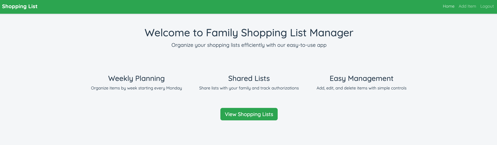

## 1. Introduction

### 1.1 Problem Statement
A family that wants to have a shared shopping list that members can update.  
A tool to keep on top of family chores and ensure everybody is doing what they are responsible for.  

### 1.2 Purpose
A simple shared shopping list reminder so that things are not forgotten.  
A group management app.  

### 1.3 Target Audience
Any group of people who share tasks and responsibilities, such as:
- Families
- Student houses
- Shared accommodations

---

## 2. Features

### 2.1 MVP Features
- The primary feature is a shopping list that can be added, deleted, and amended.
- Quick and simple entry of items to be added to the shopping list by an authorized user with their own login.

## 3. User Instructions
### The website is accesible from https://shopping-list-rab-d9ead83627b5.herokuapp.com/shopping/

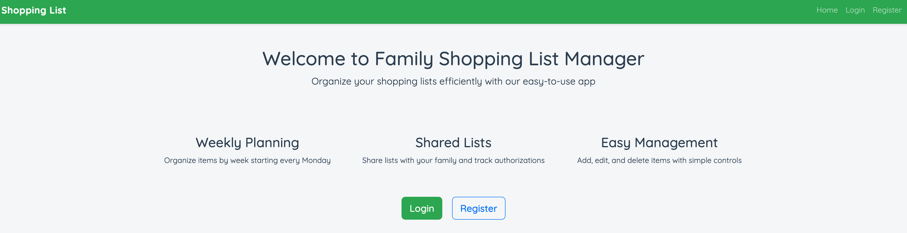

### If a User is not registered they create an acount 

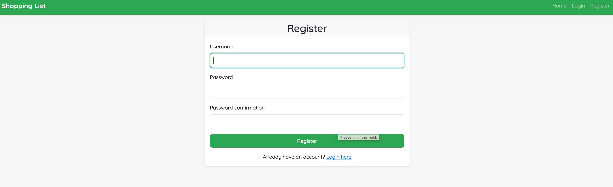

### To change profiles and privileges you must login as a Super_User on the Django Admin site.

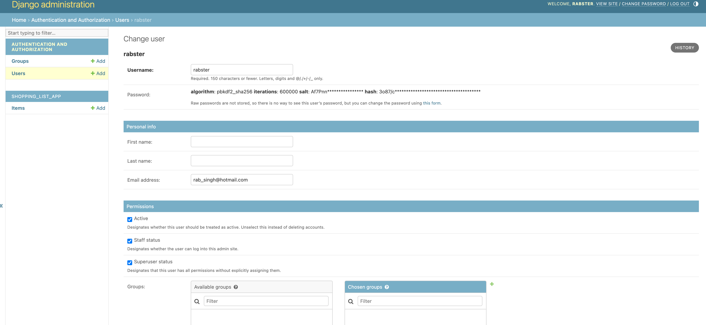

### To add an item select "Add Item" and complete the form.

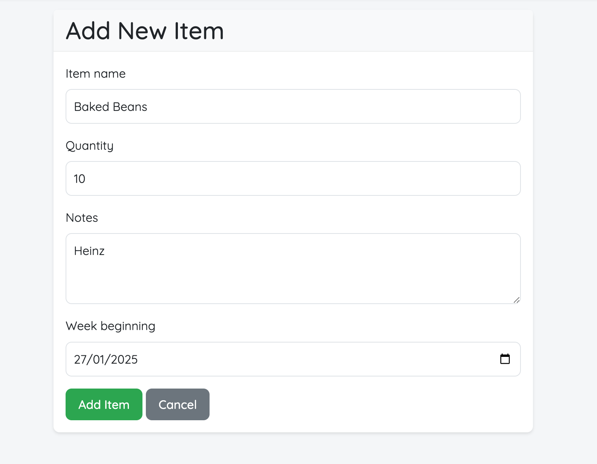

### Items in the list can be filtered using the filter form at top of the screen.

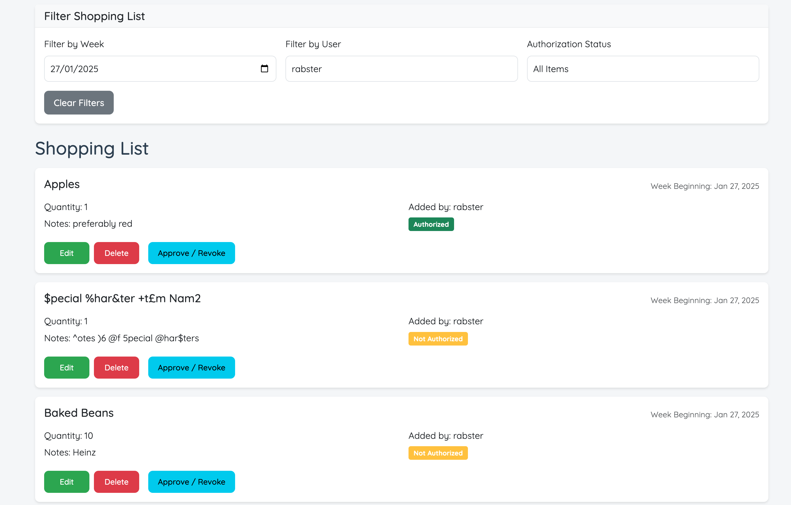

---

## 4. User Stories & Use Cases

### 4.1 User Stories
- **As a parent**, I want to add members to my shopping list app so that they can use my app.
- **As a parent**, I want to have a simple, easy-to-use shopping list always to hand so I never forget buying items for the home.
- **As a child**, I want to add items that I need my parents to buy so I have what I need.
- **As a parent**, I want to approve any items added to the list so I have the final say on what is purchased.
- **As an admin**, I want to control who uses the app and how they use it.

### 4.2 Use Cases
#### 4.2.1 Register a Super-User/ User
- **Actor:** Super-User (Parent) / Normal User (Child)
- **Description:** Users register to create an account.
- **Steps:**
  1. A Normal User enters a username and password to create an account.
  2. A Super-User is registered from the Django Admin page.

#### 4.2.2 Create and Manage Shopping Lists
- **Actor:** Super-User (Parent)
- **Description:** Users can create, edit, and organize shopping lists for groceries.
- **Steps:**
  1. Super-User opens the app and selects "Add an Item".
  2. Super-User adds items to the list peer week beginning and can specify optional notes.
  3. Super-User can edit or remove any items.
  4. Super-User marks an item as "Approved," which is updated across all devices.
  5. Super-User can "Revoke" a previously "Approved" item.
  6. Lists are automatically saved and synced across all family members’ devices.
  
#### 4.2.3 Add to a Shopping List
- **Actor:** Child
- **Description:** User can add items to shopping lists.
- **Steps:**
  1. User opens the app and selects "Add an Item".
  2. User adds items to the list and specifies optional notes.
  3. User can edit or remove only their own items.
  4. Lists are automatically saved and synced across all family members’ devices.

---

## 5. Wireframes
Wireframes were created to approximate the look of the app.
These designs were superseded as development progressed.

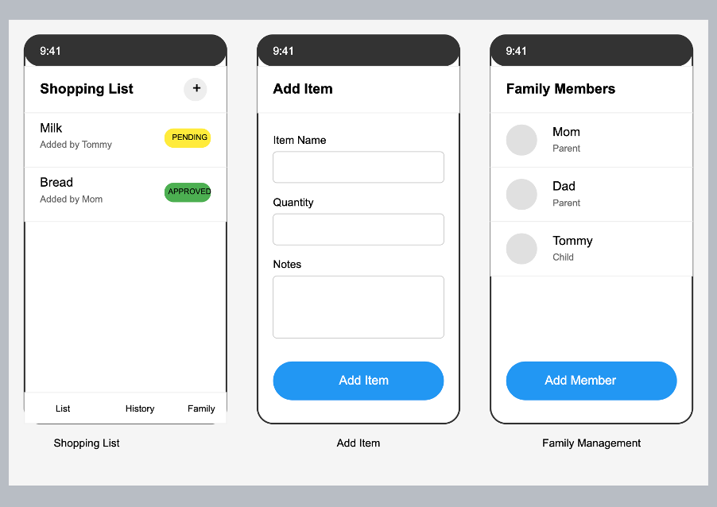

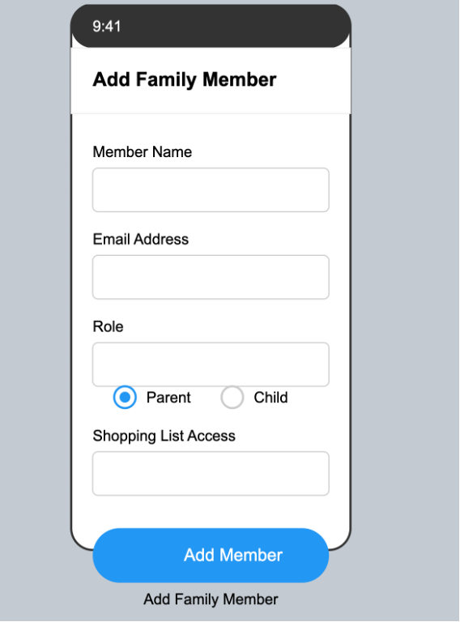

---

## 6. Technologies Used

### 6.1 Frontend
- **HTML:** For structuring web content.
- **CSS:** For styling and layout.
- **Bootstrap 5.3.0:** For responsive design and prebuilt components.
- **JavaScript:** For dynamic user interactions.

### 6.2 Backend
- **Python:** Programming language.
- **Django:** Web framework for building the backend logic and database integration.

### 6.3 Database
- **PostgreSQL:** Relational database for storing application data.

### 6.4 Deployment
- **Heroku:** Platform for hosting the application.

### 6.5 Version Control
- **GitHub:** For code hosting and version control.

### 6.6 Authentication
- **Django's in-built user class :** For managing parent and child roles.

### 6.7 Other 
- **AI engines:** ChatGPT and Claude were used to check details of project scoping and planning as well as assist extensively with aspects of coding.

---

## 7. Database Schema (ERD)

The Entity Relationship Diagram (ERD) below shows the relationships between the database entities used in the Shopping List App.

Th User table stores the profile details of registered Users whilst the Item class stores attributes relatd to items to be ordered.

Items are linked to Users using a ForeignKey field in the database schema (Items.added_by - Users.id).

The User to Items relationship is a one-to-many. 

Django's inbuilt  User, part of the django.contrib.auth module, was used. 
This class is designed to handle authentication and user-related data such as usernames and passwords.

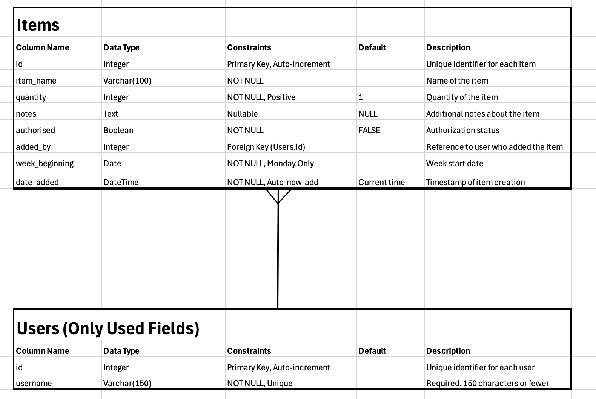

---

## 8. Validation

### 8.1 HTML Validation
The app’s HTML has been validated using the W3C Markup Validator to ensure proper coding standards.

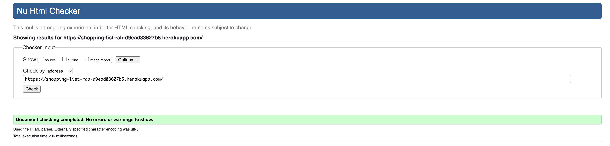

### 8.2 CSS Validation
The app’s CSS has been validated using the W3C CSS Validator to ensure proper coding standards.

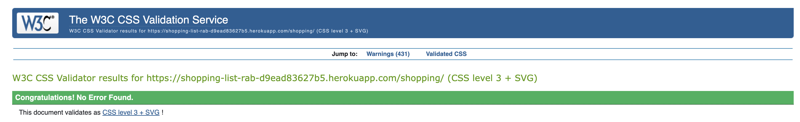

### 8.3 Testing
- Extensive tests for key functionalities like registering, login, adding, deleting, and approving items are documented in the TESTING.md
([Testing Documentation](TESTING.md))

### 8.4 Performance Testing
- Google Lighthouse was used to test the performance of the website.
- The results of the tests showed a performance of 93.
- Screenshot of complete test results are listed below.

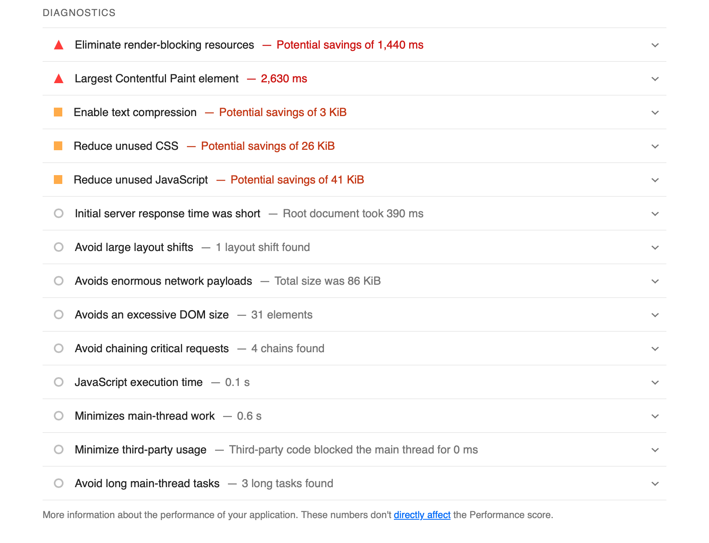
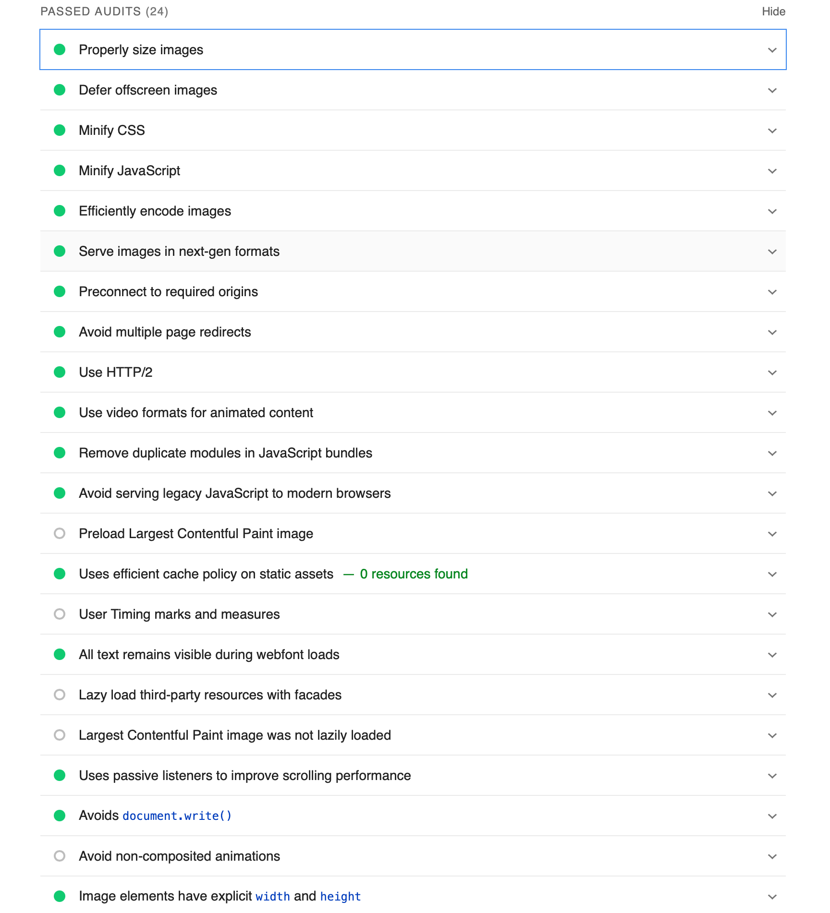
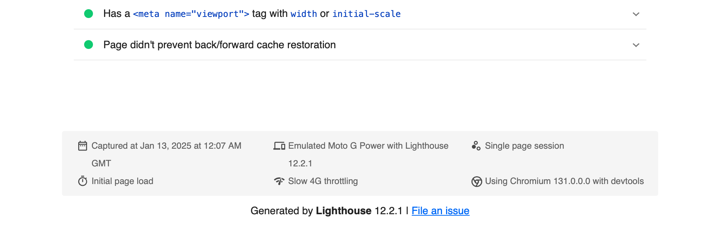

### 8.5 Python Linter Testing
- CI Python Linter was used to check py files 
- Screenshots of test results are shown below

Admin.py
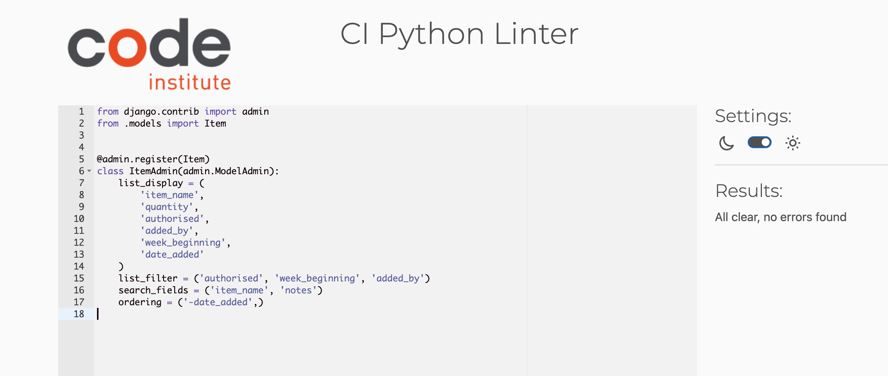

Forms.py
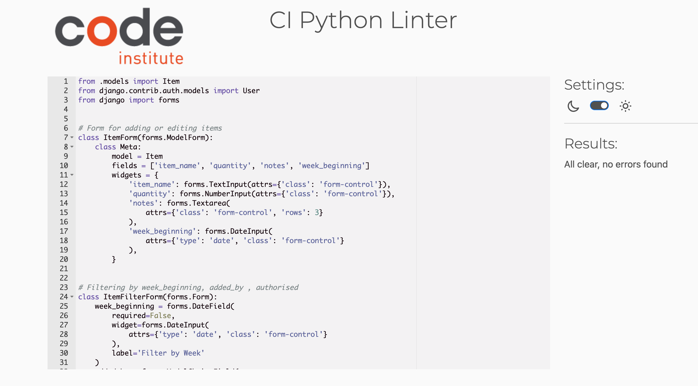

Model.py
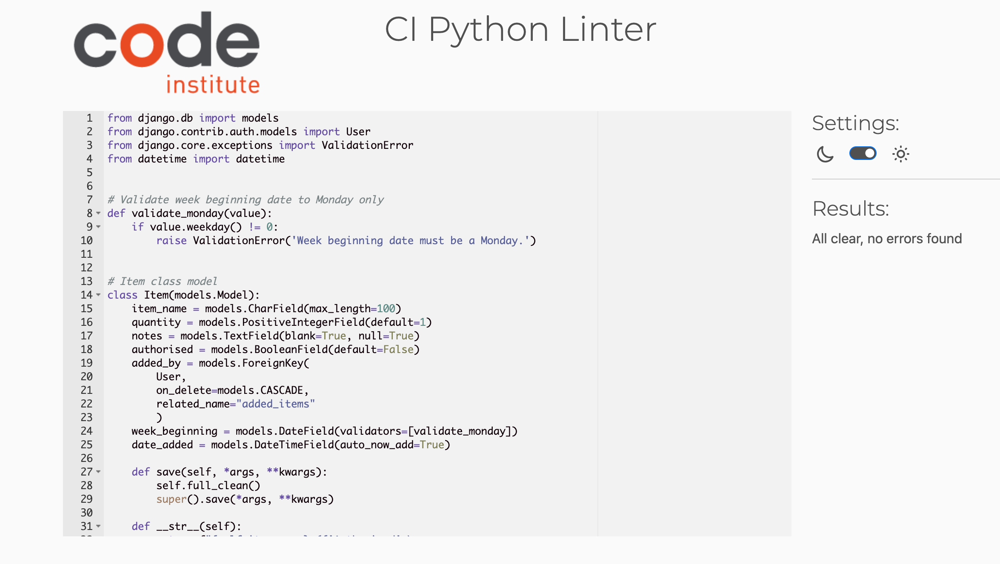

Url.py
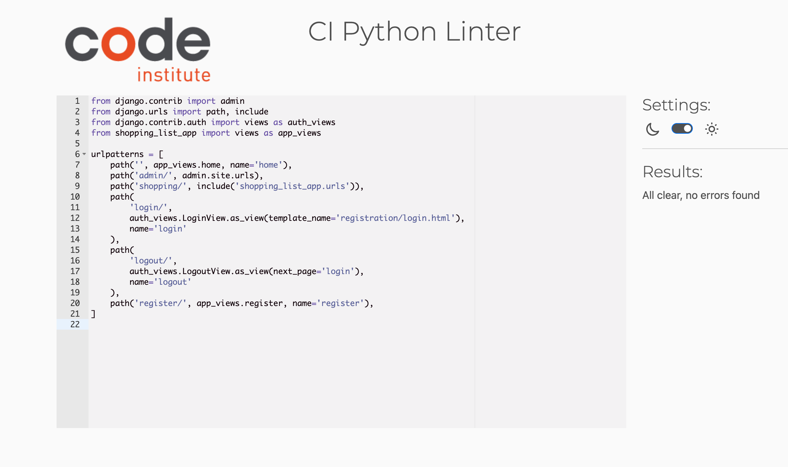

Url.py

Views.py 
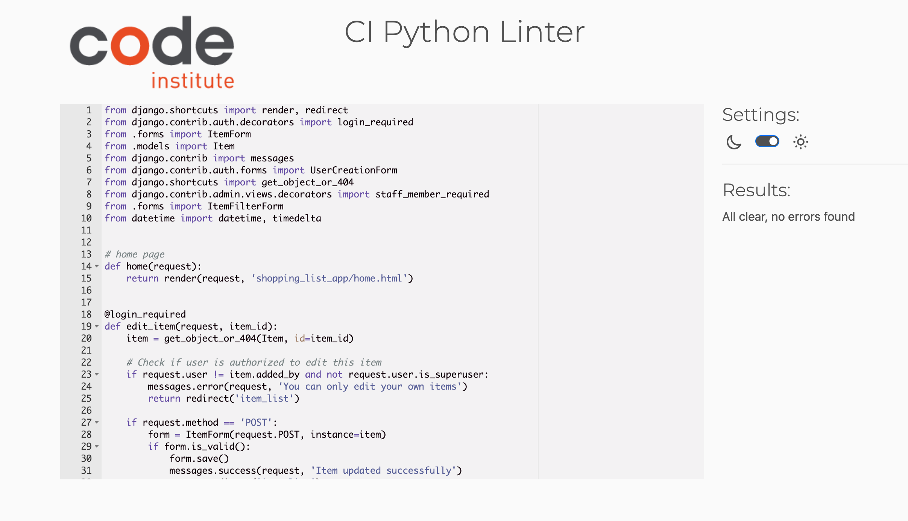

---

## 9. Future Scope
### Additional Features (for future development)
- A chore list that links to the shopping list.
- Children would complete chores and be rewarded so they can add items to the shopping list.
- Parents would determine rewards/ points on the completion of chores.

---

## 10. Acknowledgments

- [W3C Validator] for HTML & CSS validation.
- [Bootstrap](https://getbootstrap.com/) for responsive design.
- [Google Lighthouse](https://developers.google.com/web/tools/lighthouse) for performance testing.
- ChatGPT and Claude for assisting throughout the project.

---
