# Shopping List App - Complete Test Documentation

Date: January 11, 2025  
Tester: [Rabinder Singh]

## 1. User Registration and Authentication Tests

### T1 - Standard User Registration
**Priority:** High  
**Feature:** User Registration  
**Test Steps:**  
1. Navigate to registration page  
2. Enter new username "testuser"  
3. Enter valid password "Test123!"  
4. Confirm password "Test123!"  
5. Submit registration  

**Expected Result:** Account created, success message shown  
**Actual Result:** Account created , success message displayed  
**Status:** [Pass]  
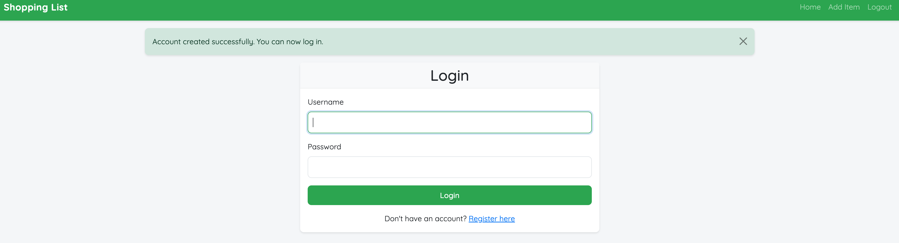

### T2 - Registration with Mismatched Passwords
**Priority:** High  
**Feature:** User Registration  
**Test Steps:**  
1. Navigate to registration page  
2. Enter username "testuser2"  
3. Enter password "Test123!"  
4. Enter confirmation "Test456!"  
5. Submit registration  

**Expected Result:** Error message about password mismatch  
**Actual Result:** Error message displayed
**Status:** [Pass]  
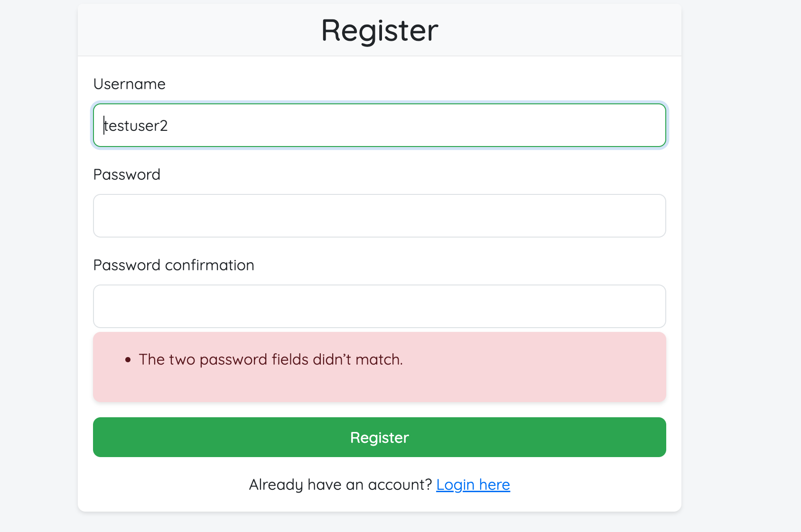

### T3 - Duplicate Username Registration
**Priority:** High  
**Test Steps:**  
1. Attempt to register with existing username  
2. Use valid password  
3. Submit registration  

**Expected Result:** Error about existing username
**Actual Result:**  Error message as expected  
**Status:** [Pass]  
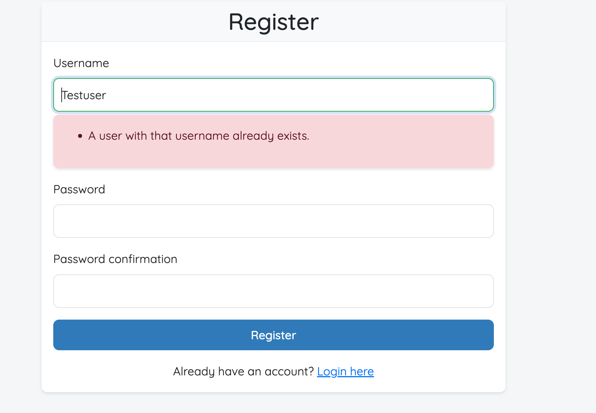

## 2. Item Creation Tests

### T4 - Create Valid Item
**Priority:** High  
**Feature:** Item Creation  
**Test Steps:**  
1. Login as test user  
2. Navigate to Add Item page  
3. Enter:  
   - Item name: "Test Item"  
   - Quantity: 1  
   - Week Beginning: [Jan 13th 2025]  
   - Notes: "Test notes"  
4. Submit form  

**Expected Result:** Item created successfully  
**Actual Result:** New item displayed added successfully
**Status:** [Pass]  
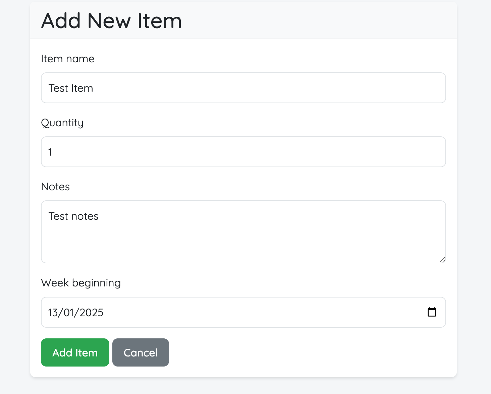
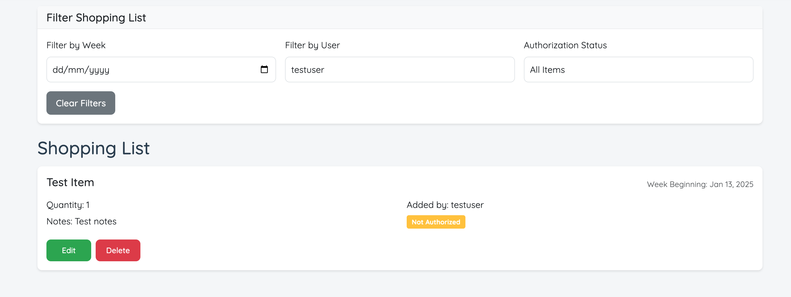

### T5 - Create Item with Non-Monday Date
**Priority:** High  
**Test Steps:**  
1. Follow item creation process  
2. Enter non-Monday date: [15th Jan 2025]
3. Submit form  

**Expected Result:** Validation error for date  
**Actual Result:** "Week beginning must be a Monday" error message displayed 
**Status:** [Pass]  
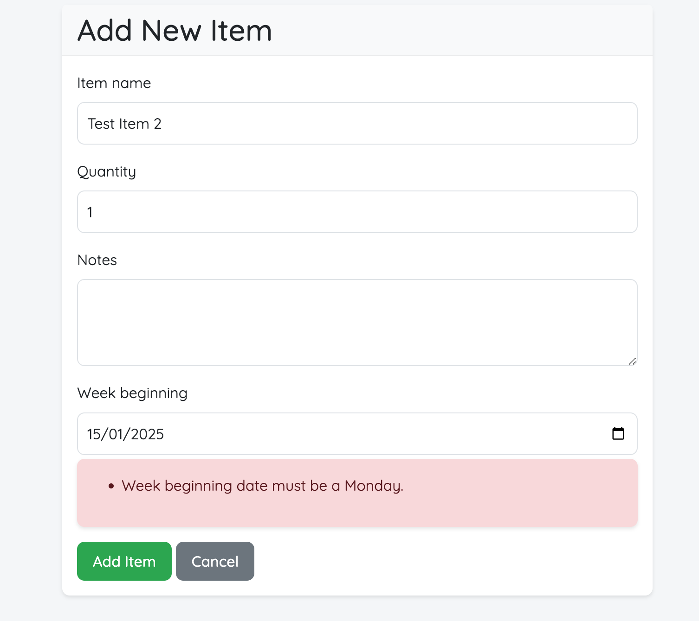

## 3. Item List View Tests

### T6 - Filter by Week
**Priority:** Medium  
**Test Steps:**  
1. Create multiple items with different weeks  
2. Apply week filter  
3. Check results  

**Expected Result:** Only items from selected week shown  
**Actual Result:** Correct filtered items displayed
**Status:** [Pass]  
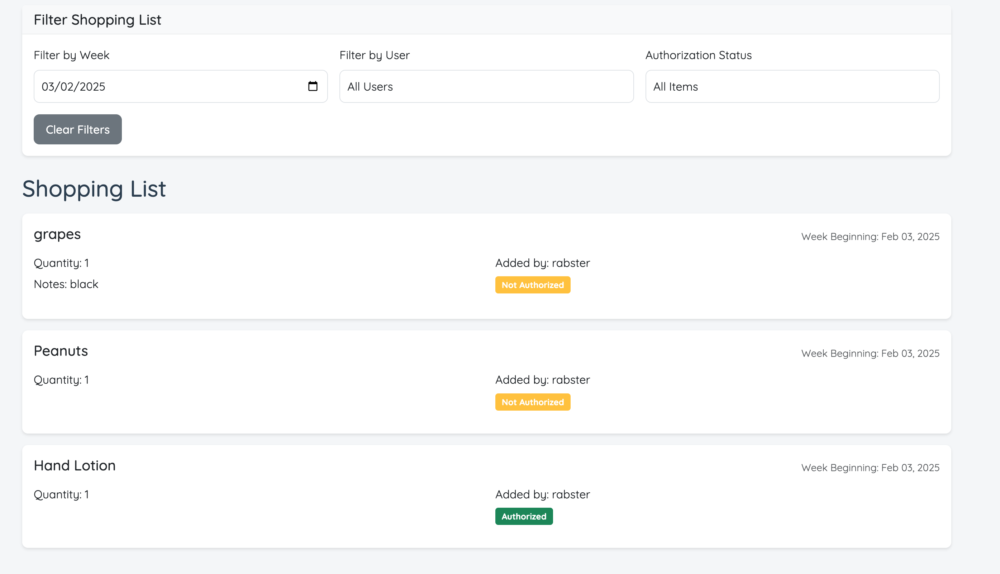

### T7 - Filter by User
**Priority:** Medium  
**Test Steps:**  
1. Create items with different users  
2. Apply user filter  
3. Verify results  

**Expected Result:** Only selected user's items shown  
**Actual Result:** Correct filtered items displayed
**Status:** [Pass]  
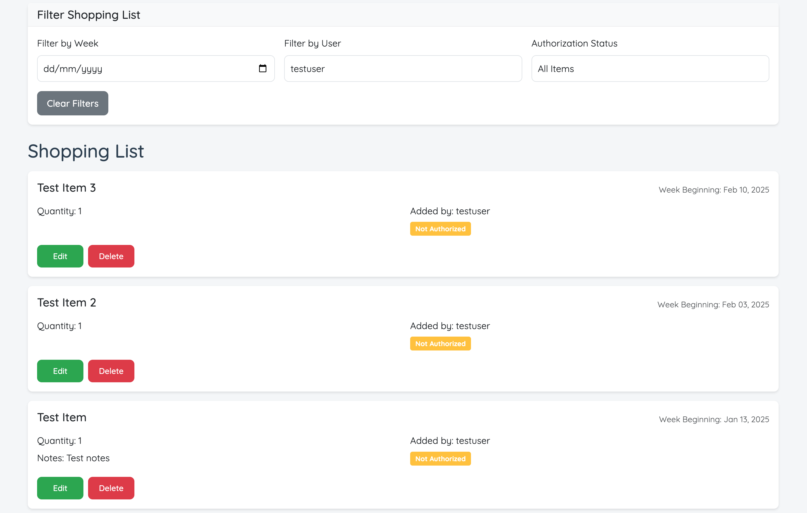

## 4. Item Editing Tests

### T8 - Edit Own Item
**Priority:** High  
**Test Steps:**  
1. Locate own item  
2. Modify all fields  
3. Save changes  

**Expected Result:** Changes saved successfully  
**Actual Result:** As expected
**Status:** [Pass]  
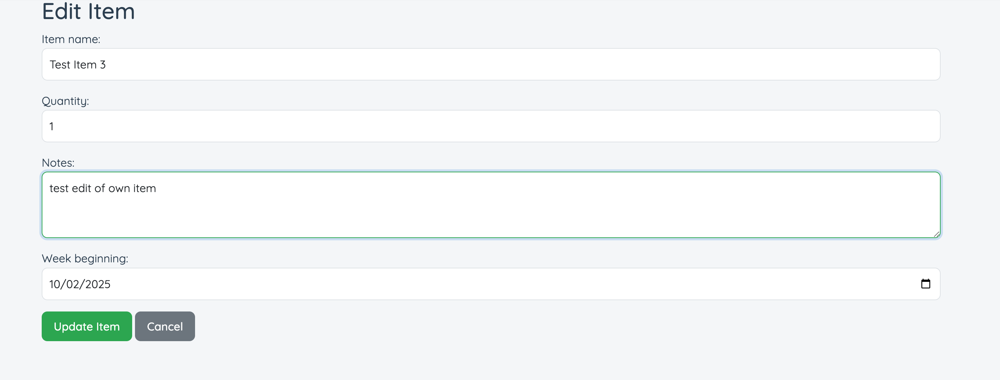
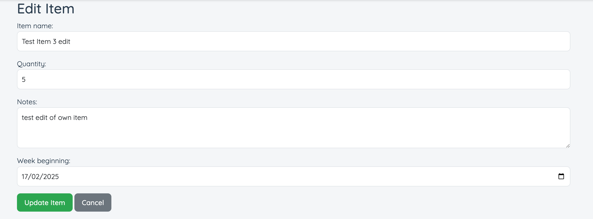

### T9 - Edit Others' Items
**Priority:** High  
**Test Steps:**  
1. Attempt to edit another user's item  
2. Submit changes  

**Expected Result:** No Edit facility other then for own items  
**Actual Result:** No Edit button or facility other then for own items
**Status:** [Pass]  
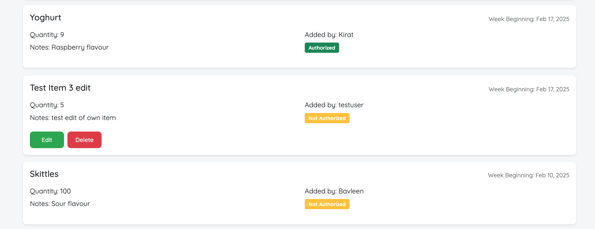

## 5. Item Deletion Tests

### T10 - Delete Own Item
**Priority:** High  
**Test Steps:**  
1. Create test item  
2. Delete item  
3. Verify deletion  

**Expected Result:** Item deleted successfully  
**Actual Result:** Item deleleted successfully message displayed
**Status:** [Pass]  
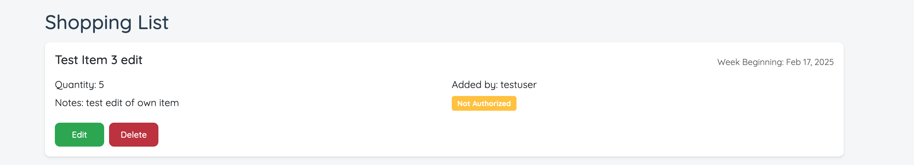
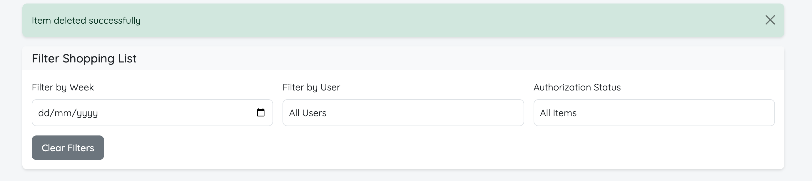

### T11 - Delete as Super User
**Priority:** High  
**Test Steps:**  
1. Login as staff  
2. Delete any item  
3. Verify deletion  

**Expected Result:** Item deleted successfully  
**Actual Result:** Item deleleted successfully message displayed
**Status:** [Pass]  
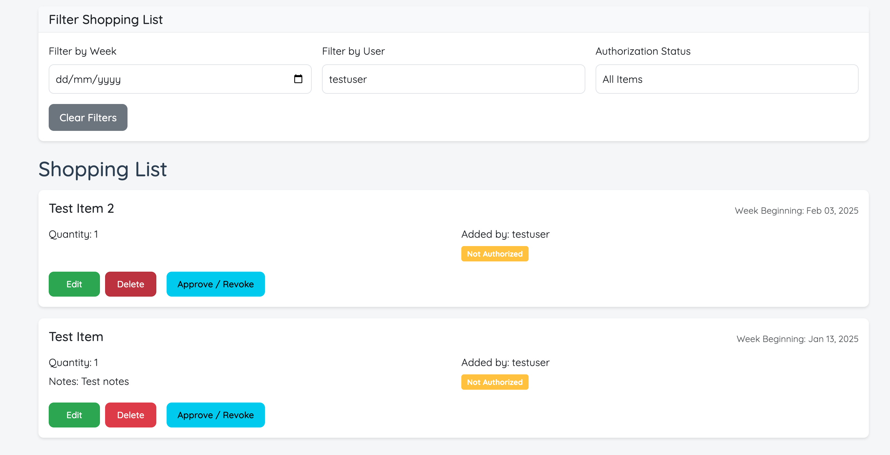
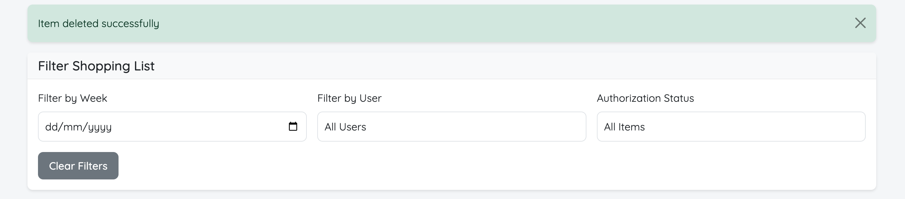
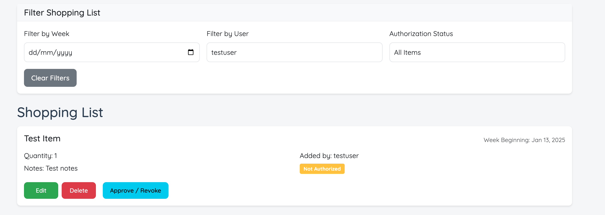

## 6. Authorization Tests

### T12 - Authorize as Superuser
**Priority:** High  
**Test Steps:**  
1. Login as superuser  
2. Locate pending item  
3. Toggle authorization  
4. Verify status change  

**Expected Result:** Authorization status changed  
**Actual Result:** Item authorised 
**Status:** [Pass]  
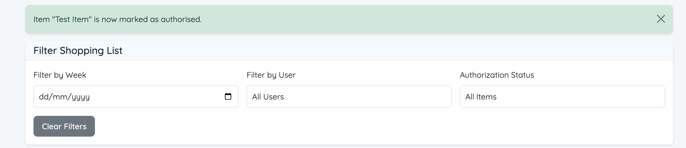
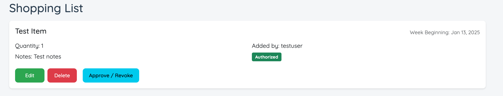

## 7. User Interface Tests

### T13 - Responsive Design
**Priority:** Medium  
**Test Steps:**  
1. Test on mobile width - first screenprint  
2. Test on tablet width - second screenprint
3. Test on desktop - third screenprint  

**Expected Result:** Proper display at all sizes  
**Actual Result:** Displaying correctly and clearly
**Status:** [Pass]  
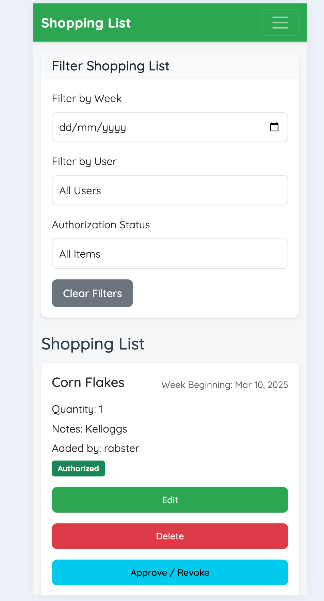
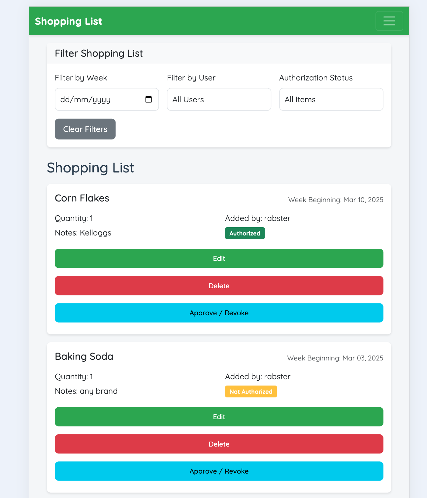
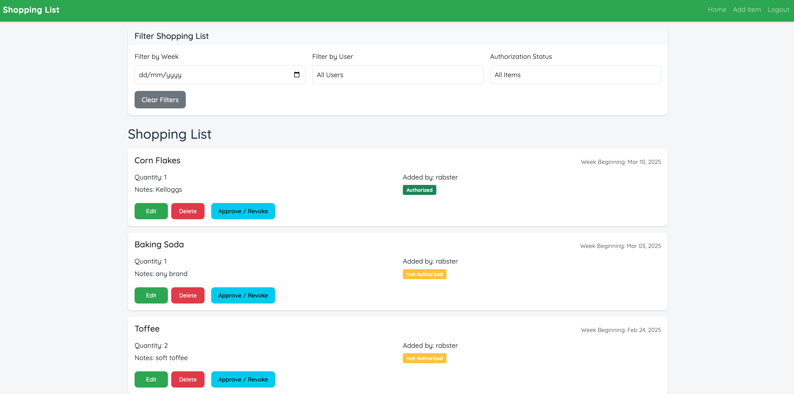

## 8. Edge Cases

### T14 - Maximum Length Item Name
**Priority:** Low  
**Test Steps:**  
1. Create item with 100-character name  
2. Submit and verify display  

**Expected Result:** Name accepted and displayed properly  
**Actual Result:** Only 100 characters dispayed 
**Status:** [Pass]  
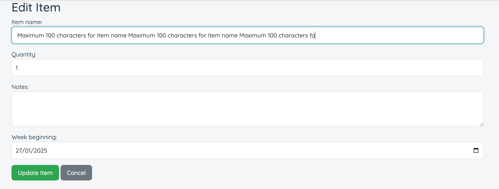

### T15 - Special Characters
**Priority:** Low  
**Test Steps:**  
1. Create item with special characters  
2. Verify storage and display  

**Expected Result:** Characters handled correctly  
**Actual Result:** Characters handled correctly
**Status:** [Pass]  
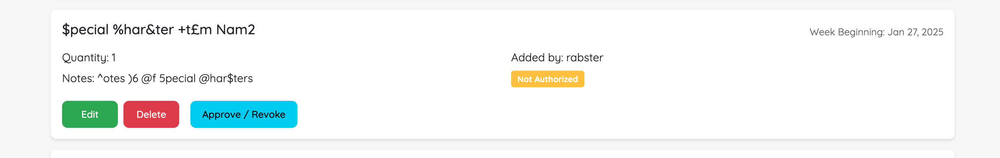

## 9. Permission Tests

### T16 - Super-User Access Rights
**Priority:** High  
**Test Steps:**  
1. Login as super-user  
2. Attempt all operations  
3. Verify permissions  

**Expected Result:** Appropriate access levels  
**Actual Result:** Super-User access working at all levels
**Status:** [Pass]  
**Screenshot:** Evidenced from Screenshot already provided in other tests

### T17 - Regular User Rights
**Priority:** High  
**Test Steps:**  
1. Login as regular user  
2. Attempt various operations  
3. Verify restrictions  

**Expected Result:** Appropriate restrictions  
**Actual Result:** Regular Users restricted access working correctly
**Status:** [Pass]  
**Screenshot:** Evidenced from Screenshot already provided in other tests

## 10. Data Validation Tests

### T18 - Required Fields
**Priority:** High  
**Test Steps:**   
1. Check validation messages
2. Test quantity limits   

**Expected Result:** Proper validation errors  
**Actual Result:** Validation level set to high 
**Status:** [Pass but improvement required]  
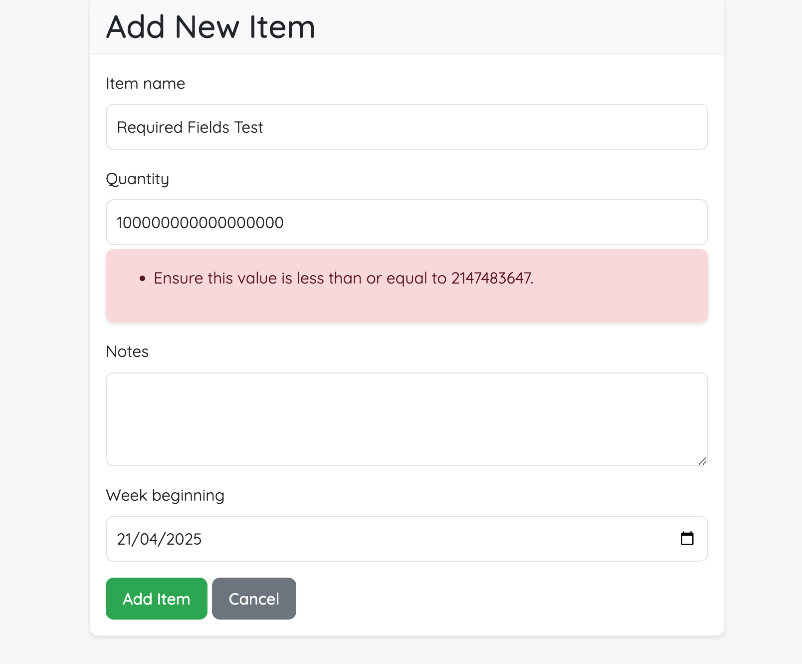

### T19 - Field Constraints
**Priority:** High  
**Test Steps:**    
1. Verify constraints  

**Expected Result:** All constraints enforced  
**Actual Result:** Missing date field not allowed 
**Status:** [Pass]  
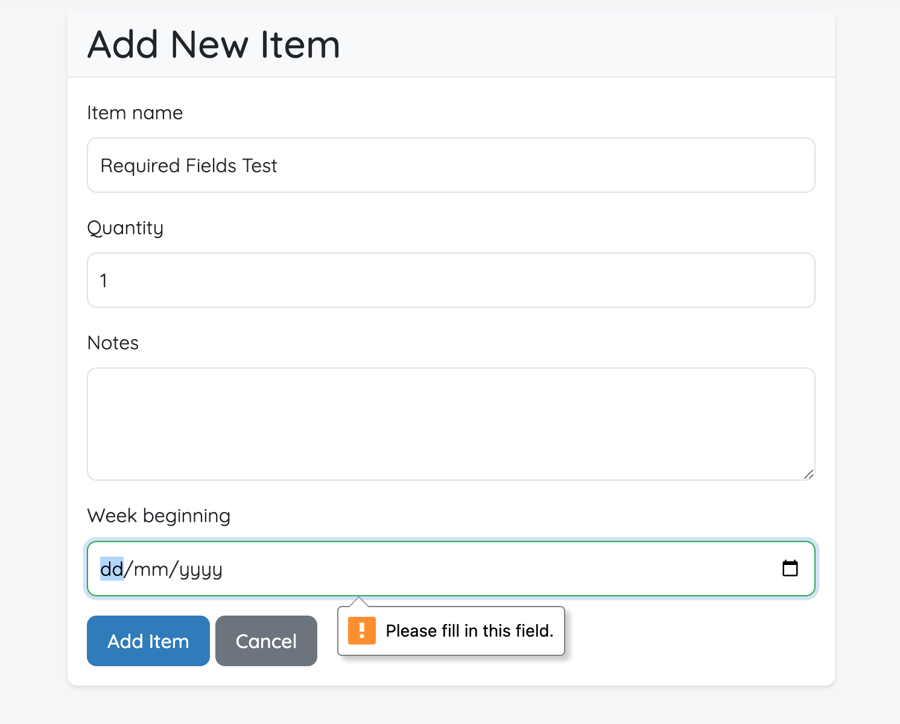

## Test Summary

### Results Overview
- **Tests Passed:** [19]  
- **Tests Failed:** [0]  
- **Pass Rate:** [100%]  

### Environment Details
- **Browser:** [Chrome]  
- **Screen Resolution:** [1920 x 1080]  
- **OS:** [IOS]  

### Known Issues
1. Quantity value needs a limit 

### Recommendations
1. Grey out all days other then Monday for week beginning  - medium priority 
2. Limit quantity field - low priority

